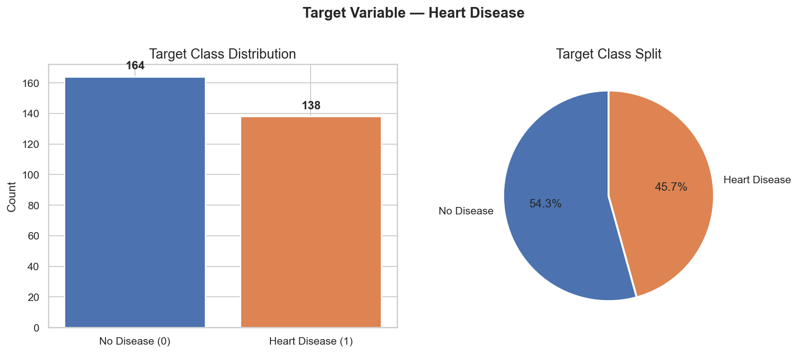
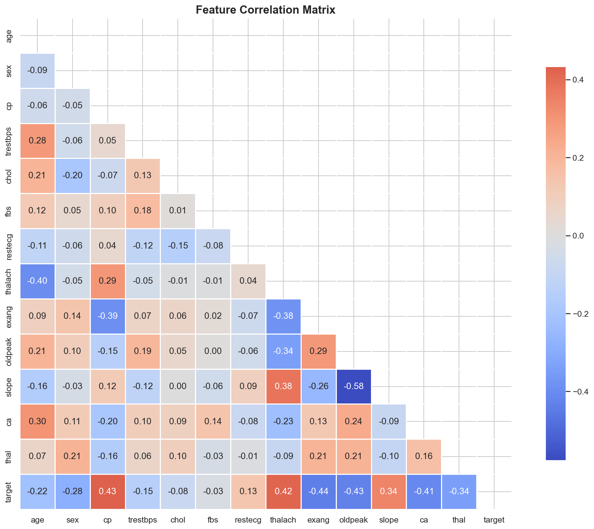
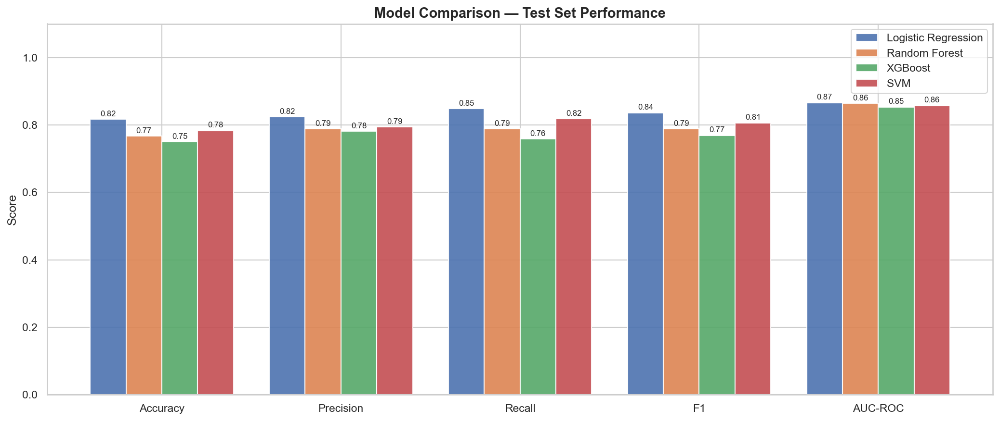
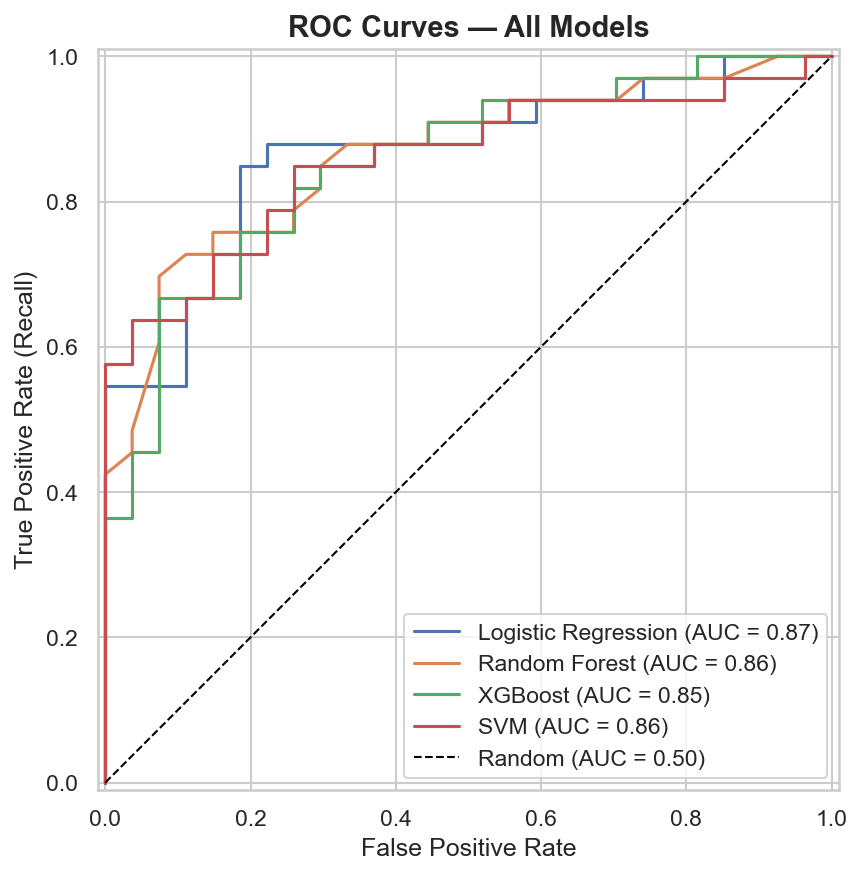
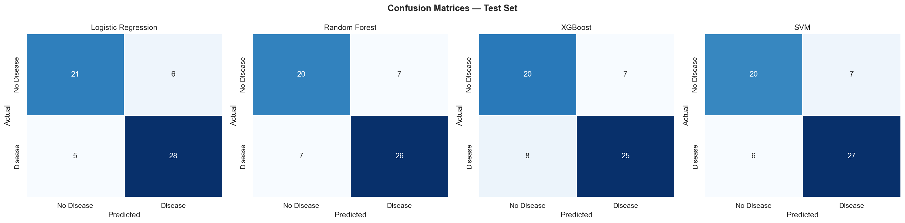
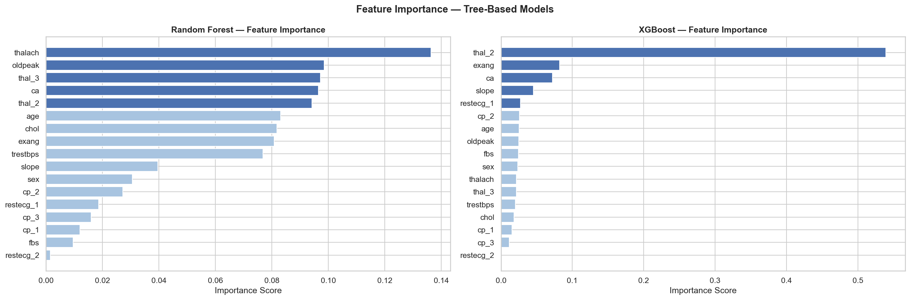

# 🫀 Heart Disease Prediction — Machine Learning Project

> Binary classification project predicting the presence of heart disease using clinical patient data.  
> Built with Python across 4 structured notebooks covering EDA, Preprocessing, Modelling, and Evaluation.

[](https://python.org)
[](https://scikit-learn.org)
[](https://xgboost.readthedocs.io)
[](https://jupyter.org)
[](LICENSE)

---

## 📊 Results at a Glance

| Model | Accuracy | Recall | F1 | AUC-ROC |
|---|---|---|---|---|
| **Logistic Regression** ✅ | **0.82** | **0.85** | **0.84** | **0.87** |
| SVM | 0.78 | 0.82 | 0.81 | 0.86 |
| Random Forest | 0.77 | 0.79 | 0.79 | 0.86 |
| XGBoost | 0.75 | 0.76 | 0.77 | 0.85 |

> **Best model: Logistic Regression** — selected on Recall as the primary metric.  
> In a medical context, minimising False Negatives (missed disease cases) is more critical than minimising False Alarms.

---

## 📁 Project Structure

```
heart-disease-ml/
├── data/
│   ├── heart.csv                  ← raw dataset
│   └── processed/                 ← train/test splits saved after preprocessing
├── notebooks/
│   ├── 1_eda.ipynb                ← exploratory data analysis
│   ├── 2_preprocessing.ipynb      ← cleaning, encoding, scaling
│   ├── 3_modelling.ipynb          ← training & comparing 4 models
│   └── 4_evaluation.ipynb         ← deep evaluation of best model
├── plots/                         ← all generated visualisations
├── index.html                     ← GitHub Pages portfolio site
├── requirements.txt
└── README.md
```

---

## 📂 Dataset

**Source:** [Heart Disease Dataset — Kaggle (johnsmith88)](https://www.kaggle.com/datasets/johnsmith88/heart-disease-dataset)

- Combined from 4 hospital databases: Cleveland, Hungary, Switzerland, VA Long Beach
- 1,025 raw records → **302 after deduplication**
- 13 clinical features + 1 binary target (0 = no disease, 1 = disease)
- Target split: 54.3% no disease / 45.7% disease — near balanced, no SMOTE required

| Feature | Description |
|---|---|
| `age` | Patient age |
| `sex` | Sex (1=male, 0=female) |
| `cp` | Chest pain type (0–3) |
| `trestbps` | Resting blood pressure |
| `chol` | Serum cholesterol |
| `fbs` | Fasting blood sugar > 120 mg/dl |
| `restecg` | Resting ECG results |
| `thalach` | Maximum heart rate achieved |
| `exang` | Exercise-induced angina |
| `oldpeak` | ST depression (exercise vs rest) |
| `slope` | Slope of peak exercise ST segment |
| `ca` | Number of major vessels coloured |
| `thal` | Thalassemia type |
| `target` | Heart disease present (1=yes) |

---

## 🔬 Methodology

### 1. EDA
- Analysed distributions of all 13 features
- Identified key predictors via Pearson correlation: `cp` (+0.43), `thalach` (+0.42), `exang` (−0.44), `oldpeak` (−0.43), `ca` (−0.41)
- Found 723 duplicate rows and flagged outliers in `chol`, `trestbps`, `thalach`, `oldpeak`

### 2. Preprocessing
- Removed 723 duplicates and 2 invalid `thal=0` rows
- Winsorized outliers at 1st–99th percentile
- Applied `log1p` transform to `oldpeak` (heavy right skew)
- One-hot encoded nominal features: `cp`, `restecg`, `thal`
- Stratified 80/20 train-test split
- StandardScaler fit on training data only (no data leakage)

### 3. Modelling
- Trained 4 classifiers: Logistic Regression, Random Forest, XGBoost, SVM
- Evaluated with **10-fold stratified cross-validation**
- Final evaluation on held-out test set

### 4. Evaluation
- Confusion matrix, ROC curve, Precision-Recall curve
- Threshold analysis (0.1–0.9)
- Logistic Regression coefficient interpretation

---

## 📈 Key Visualisations

<table>
  <tr>
    <td><br><sub>Target Distribution</sub></td>
    <td><br><sub>Feature Correlation Heatmap</sub></td>
  </tr>
  <tr>
    <td><br><sub>Model Comparison</sub></td>
    <td><br><sub>ROC Curves</sub></td>
  </tr>
  <tr>
    <td><br><sub>Confusion Matrices</sub></td>
    <td><br><sub>Feature Importance</sub></td>
  </tr>
</table>

---

## ⚙️ How to Run

### 1. Clone the repository
```bash
git clone https://github.com/Marussiah/heart-disease-ml.git
cd heart-disease-ml
```

### 2. Install dependencies
```bash
pip install -r requirements.txt
```

### 3. Run notebooks in order
```
notebooks/1_eda.ipynb
notebooks/2_preprocessing.ipynb
notebooks/3_modelling.ipynb
notebooks/4_evaluation.ipynb
```

> ⚠️ Run notebooks from the `notebooks/` directory, or adjust file paths if running from root.

---

## 🛠️ Tech Stack

- **Python 3.10**
- **pandas**, **numpy** — data manipulation
- **matplotlib**, **seaborn** — visualisation
- **scikit-learn** — modelling and evaluation
- **xgboost** — gradient boosting
- **scipy** — statistical transforms
- **jupyter** — notebook environment

---

## ⚠️ Limitations

- Small dataset (302 rows) limits generalisation — wide CV standard deviations reflect this
- No hyperparameter tuning performed — default configurations used throughout
- Gender imbalance: 206 male vs 96 female patients; model may underperform on female patients
- Fixed decision threshold of 0.5 — a lower threshold (e.g. 0.3) may be clinically preferable
- Not validated on an external dataset

---

## 🔮 Future Improvements

- Hyperparameter tuning with RandomizedSearchCV
- Model stacking / voting classifier ensemble
- Threshold optimisation based on clinical cost of False Negatives
- SHAP values for individual prediction explainability
- Validation on external dataset

---

## 📄 License

This project is licensed under the MIT License.
